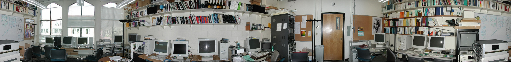

<h2></h2>
<div align="right">姓名：陳力宇&nbsp;&nbsp;&nbsp;&nbsp;學號：R08922069</div>
<h1 align="center">Project 2</h1>

## Image Stitching


**實作內容：**

1. **Feature Detection: MSOP**
   - 實作課堂提到的 MSOP 來找出 features，使用了原圖加上四層 **Gaussian pyramid** 共五個 layers，每層的 size 皆為前一層的 1/2。
   - 每個 layer 實作 **Harris Corner Detector**：找出所有 corner strength 的 local maxima，若是原始圖片有超過一百萬個 pixels，則跳過原圖 (layer 0) 以加速。
   - 實作 **Adaptive Non-maximal Suppression**：每個 feature point 必須為半徑 r 中最大的 corner strength，降低半徑直到剩下 500 個 feature points。
   - 實作 **Sub-pixel Refinement**：使用 taylor expansion 為每個 feature point 的座標做微調。
2. **Feature Descriptor: MSOP**
   - 找出每個 feature point 的 gradient 當作 **major orientation**。
   - 利用 gradient 的方向取出一塊 patch 並且 normalize 當作 **descriptor**。
3. **Feature Matching: K-D tree**
   - 利用每張照片的 feature descriptor 找出 match，這邊使用 OpenCV 的 **cv::flann** library 加速。
4. **Cylindrical Warping**
   - 將所有照片 warp 到半徑為 focal length 的圓柱面上。
   - 同時也計算 feature points 經過 warp 後的新座標。
5. **Image Matching and Recognising Panoramas** (bonus)
   - 使用 **RANSAC** 找出 feature 間的 homography，這邊只使用 2D translation，同時 reject outliers。
   - 找出原始照片中最適合的 panoramas 連接組合，只要有超過兩張照片以上的連接，就會被記錄為一組 panorama。
6. **Image Blending: Constant width alpha blending**
   - 將每個 panoramas 組合 blend 起來，若有 N 個組合則會產生 N 張全景圖。
   - 為了減少鬼影，在兩張照片重疊的中間線，只在左右固定的寬度做 **alpha blending**。
   - 若是 panoramas 組合的第一張和最後一張照片相同，則做 **drift correction**，計算 drift 大小對整張圖做 shear。(最後一張照片只拿來計算 drift，並不會 blend 進去全景圖)
7. **Parallel Computation** (bonus?)
   - 使用 **OpenMP** 平行化可以獨自計算的部分，在多核心的機器上有明顯的效能進步。
8. **Approximate Optimization:** --fast-approximation
   - 在拍攝原始照片時，通常不會有過多的旋轉，導致 MSOP 的 orientation 其實幫助不大，反而還會增加運算時間，因此提供了這個 argument flag 來跳過 orientation 的計算。
   - 若原始照片非常大張，會造成 ANMS 時需要考慮的 feature points 太多，因此提供了這個 argument flag 來預先降低 feature points 的數量。
9. **Feature Matches Visualization:** --save-feature-matches
   - 提供了這個 argument flag，將每組 panorama 的照片間的 feature matches 存成圖片。

---

**使用方法：**

將照片放在同一個資料夾中，接著編譯及執行，指定照片資料夾的路徑，程式會自動載入所有副檔名為 .jpg 或是 .JPG 的圖片。

```bash
$ cd Image-stitching/
$ make
$ ./stitcher image_dir/ [optional arguments]
```

Optional arguments:

- --save-feature-matches: 將全景圖的原始照片的 feature matches 存成圖片。
- --fast-approximation: 不使用 oriented patch，和 ANMS 時預先減少 feature points 的數量。

程式會產生切除黑邊的全景圖 (panorama[i]-crop.jpg) 和未切除的黑邊的全景圖 (panorama[i].jpg) 在目前的目錄中。(i 為第幾組全景，照片資料夾中可以有不同地方拍攝的原始照片，程式會自動找出哪些是同一組全景。)

如果有使用 --show-feature-matches，會產生 pano[i]-[j]-[img1]to[img2].jpg 在目前的目錄中。(i 為第幾組全景，j 為由左到右第幾對 match，img1, img2 為圖片的編號)

**開發環境：**

g++ version 9.3.0 on (WSL Ubuntu 18.04 LTS, and Arch Linux)

**Library:**

1. [OpenCV](https://opencv.org)
2. [OpenMP](https://www.openmp.org/)

---

**Result:**

使用相機：SONY ILCE-6000 加上腳架
手動模式：固定光圈，ISO，快門時間

- **Lake**


- **Farm**


- **Meadow**


- **Building**


- Test data from the course website



---

--save-feature-matches 的其中一張 example

- 檔名 **pano1-7-6to14.jpg** 表示第 1 組 panorama 中的第 7 對照片，左邊的照片是編號 7 右邊是 14。
- **紅色的圓圈**是 feature points，**綠色的線**是 match。
- 可以看出大致是 2D translation 的關係。
- MSOP 的效果非常好，湖面的倒影也可以被正確辨識並 match 起來。


---

**Problem and Notice:**

-  Focal length 的估計是 cylindrical warping 成功的關鍵，錯誤的 focal length 會造成無法用 2D translation 表示圖片的位移，產生畫面的不連續。我是利用 CMOS sensor size 及鏡頭上的 focal length 來計算用 pixel 作為單位的 focal length。

- 若是原始照片的曝光值不同，直接 blend 在一起會出現明顯色差。

---

結果圖片在 result 資料夾內。
原始照片在 images 資料夾內。
